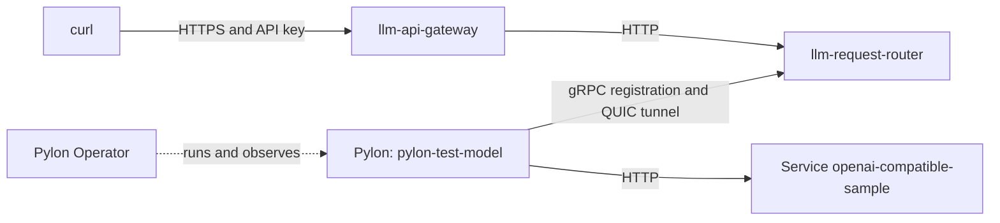

# Inference Endpoints Quickstart (k3d)

This page runs the Inference Endpoints stack on a local
[k3d](https://k3d.io/) cluster: the LLM API gateway, the LLM request router,
Pylon Operator and one OpenAI-compatible model. Use it to develop and test the
operator, the charts, the gateway, the router or Pylon. The steps match the
end-to-end test in `tests/e2e/pylon-operator-k3d`.

<Info>
This setup is only for local development. It uses a sample backend that
returns fixed text, no GPUs and a self-signed CA.
</Info>

## What you get

One k3d cluster, `pylon-op-e2e`, with three namespaces:

- `llm-stack`: the `llm-gateway-stack` umbrella chart. It runs the LLM API
  gateway (`llm-api-gateway`, HTTPS on port 8080, static API keys) and the LLM
  request router (`llm-request-router`, Stargate, static cluster credential).
  The chart generates a CA and the router and gateway certificates.
- `pylon-operator`: Pylon Operator, watching namespace `models`.
- `models`: the sample backend (Deployment and Service
  `openai-compatible-sample`, model `test-model`, port 8000) and the
  `InferenceEndpoint` `test-model`. For that endpoint the operator runs the
  transport Deployment `pylon-test-model`.

Pylon, in the transport pod, registers `test-model` with the router over
plaintext gRPC on port 50071. It also opens a QUIC reverse tunnel to the
router and verifies the router certificate against the stack CA. A caller
sends an OpenAI-compatible request with an API key to the gateway. The gateway
forwards it to the router, the router sends it through the tunnel, and Pylon
calls the backend Service.



The Makefile in `tests/e2e/pylon-operator-k3d` automates every step on this
page:

```bash
make -C tests/e2e/pylon-operator-k3d cluster images import deploy
```

The sections below show what each target does, so you can run or change one
step at a time. Run every command from the repository root.

## Prerequisites

- [Docker](https://www.docker.com/get-started), running
- [k3d](https://k3d.io/#installation) v5 or later
- `kubectl`
- `helm` 3.x
- Bazel through [Bazelisk](https://github.com/bazelbuild/bazelisk).
  `.bazelversion` pins the version.
- `curl`, `openssl`, and `shasum` (macOS) or `sha256sum` (Linux)
- `make` and `bash`
- `yq` v4, for the chart tests
- `capnp`, the Cap'n Proto compiler, in `/usr/local/bin` or `/usr/bin`. See
  [Cap'n Proto compiler](#capn-proto-compiler).
- Optional: Go, for the operator's own `make` targets, and `cargo`, for the
  Stargate tests that Bazel does not run

### Cap'n Proto compiler

Stargate and Pylon depend on the `stargate-protocol` crate, whose Cargo build
script calls `capnp`. For the Rust images, rules_rust runs that script in the
cross-compiled image configuration with a fixed `PATH` of
`/bin:/usr/bin:/usr/local/bin`.
`--action_env` does not reach it, so `capnp` must be in one of those
directories. This applies to these targets:

- `bazel run //src/libraries/rust/stargate/crates/pylon:image_load`
- `bazel run //src/libraries/rust/stargate/crates/stargate:image_load`
- `bazel test //src/libraries/rust/stargate/...`, which builds the Stargate
  and Pylon images for its image tests

Install it:

- Linux: `sudo apt install capnproto`, or the package of your distribution.
- macOS: `brew install capnp`, then link it into `/usr/local/bin`:

  ```bash
  sudo mkdir -p /usr/local/bin
  sudo ln -s "$(brew --prefix)/bin/capnp" /usr/local/bin/capnp
  ```

  A source build with the default `/usr/local` prefix works too.

The operator and gateway targets, including their Go images, do not need
`capnp`.

### Stale nvcr.io credential

The images build on public base images from `nvcr.io`. When your local Docker
credential for `nvcr.io` has expired, Bazel fails with `401 Unauthorized`
while it fetches them, before anything builds. `bazel test` and `bazel query`
on packages with image targets fail the same way. Point Bazel at an empty
Docker config directory, and it pulls the base images anonymously:

```bash
mkdir -p /tmp/empty-docker-config
bazel run --repo_env=DOCKER_CONFIG=/tmp/empty-docker-config \
  //src/compute-plane-services/pylon-operator:image_load
make -C tests/e2e/pylon-operator-k3d images DOCKER_CONFIG_DIR=/tmp/empty-docker-config
```

Use the same value for builds and tests. A different value makes Bazel fetch
the base images again. Logging in to `nvcr.io` again also fixes the error.

## Build the images

```bash
bazel run //src/compute-plane-services/pylon-operator:image_load
bazel run //src/invocation-plane-services/llm-api-gateway:image_load
bazel run //src/libraries/rust/stargate/crates/pylon:image_load
bazel run //src/libraries/rust/stargate/crates/stargate:image_load
docker build -t openai-compatible-sample:e2e examples/function-samples/openai-compatible-sample
```

With make, `make -C tests/e2e/pylon-operator-k3d images` runs the same
commands. Set `BAZEL_FLAGS` for extra Bazel flags. `make ... sample-image`
builds the sample and imports it into the cluster in one step.

| Image | Component |
| --- | --- |
| `src/compute-plane-services/pylon-operator:latest` | Pylon Operator |
| `src/invocation-plane-services/llm-api-gateway:latest` | LLM API gateway |
| `src/libraries/rust/stargate/crates/pylon:latest` | Pylon, the transport |
| `src/libraries/rust/stargate/crates/stargate:latest` | Stargate, the LLM request router |
| `openai-compatible-sample:e2e` | Sample backend from `examples/function-samples/openai-compatible-sample`: model `test-model`, port 8000, `GET /health` |

Docker records these names under `docker.io`, so the chart values below use
registry `docker.io` and the names as repositories. The images exist only in
the cluster, so every pod must use `imagePullPolicy: IfNotPresent`. With tag
`latest`, Kubernetes otherwise defaults to `Always`, and the pull fails. The
values below set `pullPolicy: IfNotPresent`.

## Create a local cluster and import images

```bash
k3d cluster create pylon-op-e2e --agents 1
kubectl config current-context    # prints k3d-pylon-op-e2e
k3d image import -c pylon-op-e2e \
  src/compute-plane-services/pylon-operator:latest \
  src/invocation-plane-services/llm-api-gateway:latest \
  src/libraries/rust/stargate/crates/pylon:latest \
  src/libraries/rust/stargate/crates/stargate:latest \
  openai-compatible-sample:e2e
```

With make, run `make -C tests/e2e/pylon-operator-k3d cluster import`.
`cluster` creates the cluster only when it does not exist; like the command
above, k3d then switches the current context to it. For an existing cluster,
`cluster` does not switch the context and fails when the current context is
not `k3d-pylon-op-e2e`. `make ... destroy` prints the delete command and runs
it only with `CONFIRM=1`.

After a rebuild, import the image again and restart the pods that use it. A
running pod keeps the old image when the tag does not change:

```bash
kubectl -n pylon-operator rollout restart deployment/pylon-operator
kubectl -n llm-stack rollout restart deployment/llm-request-router deployment/llm-api-gateway
kubectl -n models delete pod -l app.kubernetes.io/name=pylon
kubectl -n models rollout restart deployment/openai-compatible-sample
```

The operator owns the transport Deployments, so delete their pods instead of
restarting the Deployments.

## Deploy

`make -C tests/e2e/pylon-operator-k3d deploy` runs the steps in this section
through `run.sh` with `E2E_DEPLOY_ONLY=1`. It stops once the `InferenceEndpoint`
reports `Ready`, `TransportReady` and `Registered`, prints the port-forward
and `curl` commands, and leaves everything installed. It keeps the generated
files in `${TMPDIR:-/tmp}/pylon-operator-k3d-e2e` and reuses the credentials
on the next run.

The manual steps follow. Check the context first:

```bash
kubectl config current-context    # must print k3d-pylon-op-e2e
```

### Namespaces and credentials

Two secrets connect the components. Each side stores only the SHA-256 of the
secret it verifies:

- The cluster token. Pylon presents it to the router.
- The API key. Callers present it to the gateway.

```bash
WORK="${TMPDIR:-/tmp}/pylon-operator-k3d-e2e"
mkdir -p "${WORK}" && chmod 700 "${WORK}"
for ns in llm-stack pylon-operator models; do kubectl create namespace "${ns}"; done

CLUSTER_TOKEN="$(openssl rand -hex 24)"
API_KEY="$(openssl rand -hex 32)"
(umask 077 && printf '%s' "${API_KEY}" > "${WORK}/api-key")
TOKEN_SHA256="$(printf '%s' "${CLUSTER_TOKEN}" | shasum -a 256 | cut -d' ' -f1)"
API_KEY_SHA256="$(printf '%s' "${API_KEY}" | shasum -a 256 | cut -d' ' -f1)"

kubectl -n pylon-operator create secret generic e2e-cluster-credential \
  --from-literal=cluster-token="${CLUSTER_TOKEN}"
```

On Linux, use `sha256sum` in place of `shasum -a 256`. Hash with
`printf '%s'`, not `echo`, because a trailing newline changes the digest.

The pylon-operator chart can generate the token itself. This page creates it
first, so the stack can be installed before the operator, in the same order as
`run.sh`.

### LLM gateway stack

These are the values the end-to-end test uses:

```bash
cat > "${WORK}/llm-gateway-stack-values.yaml" <<EOF
clusterId: spark-e2e
clusterCredential:
  sha256Hashes:
    - sha256:${TOKEN_SHA256}
apiKeys:
  - id: e2e
    sha256: ${API_KEY_SHA256}
llm-request-router:
  llmRequestRouter:
    replicaCount: 1
    image:
      registry: docker.io
      repository: src/libraries/rust/stargate/crates/stargate
      tag: latest
      pullPolicy: IfNotPresent
llm-api-gateway:
  llmApiGateway:
    replicaCount: 1
    image:
      registry: docker.io
      repository: src/invocation-plane-services/llm-api-gateway
      tag: latest
      pullPolicy: IfNotPresent
    olric:
      env: local
EOF

helm dependency build --skip-refresh deploy/helm/llm-gateway-stack/llm-gateway-stack
helm upgrade --install llm-gateway-stack deploy/helm/llm-gateway-stack/llm-gateway-stack \
  --namespace llm-stack --values "${WORK}/llm-gateway-stack-values.yaml" \
  --wait --timeout 5m
```

- `clusterId` must match the operator's `clusterId`. The router accepts the
  token only for that cluster id.
- The chart renders the router's worker auth file from `clusterId` and
  `clusterCredential.sha256Hashes`, and the gateway's key file from `apiKeys`.
- `olric.env: local` tunes the gateway's embedded Olric cache for a single pod.

### Router CA for the operator

```bash
kubectl -n llm-stack get configmap llm-gateway-stack-ca -o jsonpath='{.data.ca\.crt}' > "${WORK}/ca.crt"
kubectl -n pylon-operator create configmap llm-gateway-stack-ca --from-file=ca.crt="${WORK}/ca.crt"
```

The operator reads its trust bundle from its own namespace and copies it next
to each transport Deployment. Pylon verifies the router's QUIC certificate
against it. The same CA verifies the gateway certificate in the `curl`
commands below.

### Pylon Operator

```bash
cat > "${WORK}/pylon-operator-values.yaml" <<EOF
image:
  repository: docker.io/src/compute-plane-services/pylon-operator
  tag: latest
  pullPolicy: IfNotPresent
clusterId: spark-e2e
router:
  grpcAddress: http://llm-request-router.llm-stack.svc.cluster.local:50071
pylon:
  image:
    repository: docker.io/src/libraries/rust/stargate/crates/pylon
    tag: latest
    pullPolicy: IfNotPresent
watchNamespaces:
  - models
credential:
  existingSecret: e2e-cluster-credential
trustBundle:
  configMap: llm-gateway-stack-ca
devInsecureTransport: false
transport:
  replicas: 1
EOF

helm upgrade --install pylon-operator deploy/helm/pylon-operator/pylon-operator \
  --namespace pylon-operator --values "${WORK}/pylon-operator-values.yaml" \
  --wait --timeout 5m
```

- `router.grpcAddress` starts with `http://` because the router serves
  plaintext gRPC on port 50071. The QUIC tunnel is still verified against the
  trust bundle.
- `credential.existingSecret` names the Secret created above, so the chart
  generates no token.
- `watchNamespaces` limits the operator to `models`.

### Backend and InferenceEndpoint

```bash
kubectl -n models apply -f - <<'EOF'
apiVersion: apps/v1
kind: Deployment
metadata:
  name: openai-compatible-sample
spec:
  replicas: 1
  selector:
    matchLabels:
      app.kubernetes.io/name: openai-compatible-sample
  template:
    metadata:
      labels:
        app.kubernetes.io/name: openai-compatible-sample
    spec:
      containers:
        - name: backend
          image: docker.io/library/openai-compatible-sample:e2e
          imagePullPolicy: IfNotPresent
          ports:
            - name: http
              containerPort: 8000
          readinessProbe:
            httpGet:
              path: /health
              port: http
---
apiVersion: v1
kind: Service
metadata:
  name: openai-compatible-sample
spec:
  selector:
    app.kubernetes.io/name: openai-compatible-sample
  ports:
    - name: http
      port: 8000
      targetPort: http
---
apiVersion: pylon.nvidia.com/v1alpha1
kind: InferenceEndpoint
metadata:
  name: test-model
spec:
  modelName: test-model
  inferenceAPIFormat:
    type: chat
  service:
    name: openai-compatible-sample
    port: 8000
  health:
    path: /health
EOF

kubectl -n models wait inferenceendpoint/test-model --for=condition=Registered --timeout=3m
```

`tests/e2e/pylon-operator-k3d/manifests/` has the same objects with resource
limits and a restricted security context.

The `InferenceEndpoint` fields:

- `modelName`: the exact `model` string callers send. The operator checks it
  against the backend's `GET /v1/models`.
- `inferenceAPIFormat.type`: `chat`, the only value in `v1alpha1`.
- `service.name` and `service.port`: a Service in the same namespace and the
  port that serves the OpenAI-compatible API.
- `health.path`: a path served on `service.port`. The operator, Pylon and the
  router all probe it.
- Optional `maxEngineConcurrency`: a concurrency hint for Pylon.
- Optional `gpu.product`: the GPU type to report. By default the operator
  reads the `nvidia.com/gpu.product` label of the backend's nodes. k3d nodes
  have no such label, so the `GPU` column stays empty.

To publish your own model, replace the Deployment and Service with your
server and set these fields to match it.

## Verify

```bash
kubectl -n models get inferenceendpoints
```

```text
NAME         MODEL        GPU   READY   REGISTERED   SERVERS   AGE
test-model   test-model         True    True         1         3s
```

`kubectl -n models describe inferenceendpoint test-model` shows the three
conditions and the Events.

Forward the gateway port in one terminal:

```bash
kubectl -n llm-stack port-forward svc/llm-api-gateway 18443:8080
```

In a second terminal, list the models. The gateway certificate covers
`127.0.0.1`, so `curl` verifies it with the stack CA:

```bash
WORK="${TMPDIR:-/tmp}/pylon-operator-k3d-e2e"
GW=https://127.0.0.1:18443
curl --cacert "${WORK}/ca.crt" "${GW}/v1/models"
```

```json
{"object":"list","data":[{"id":"test-model","object":"model","created":0,"owned_by":"nvidia"}]}
```

Show the registry, one entry per registered model with its health and, per
cluster, the registered and healthy inference servers:

```bash
curl --cacert "${WORK}/ca.crt" "${GW}/v1/registry"
```

```json
{"generatedAt":"2026-10-01T09:12:05Z","models":[{"model":"test-model","health":"Healthy","clusters":[{"clusterId":"spark-e2e","registeredServers":1,"healthyServers":1}]}]}
```

Stream a chat completion with the API key:

```bash
curl -N --cacert "${WORK}/ca.crt" "${GW}/v1/chat/completions" \
  -H "Authorization: Bearer $(cat "${WORK}/api-key")" \
  -H 'Content-Type: application/json' \
  -d '{"model": "test-model", "messages": [{"role": "user", "content": "hi"}], "stream": true}'
```

```text
data: {"choices":[{"index":0,"delta":{"role":"assistant"},"finish_reason":null}],"created":1790783551,"id":"chatcmpl_253","model":"test-model","object":"chat.completion.chunk"}

data: {"choices":[{"index":0,"delta":{"content":"xxxx"},"finish_reason":null}],"created":1790783551,"id":"chatcmpl_253","model":"test-model","object":"chat.completion.chunk"}

data: {"choices":[{"index":0,"delta":{},"finish_reason":"stop"}],"created":1790783551,"id":"chatcmpl_253","model":"test-model","object":"chat.completion.chunk"}

data: [DONE]
```

The same request without the key returns 401:

```bash
curl -s -w '\n%{http_code}\n' --cacert "${WORK}/ca.crt" "${GW}/v1/chat/completions" \
  -H 'Content-Type: application/json' \
  -d '{"model": "test-model", "messages": [{"role": "user", "content": "hi"}]}'
```

```text
{"error":{"code":"invalid_api_key","message":"Missing or invalid API key","param":"","type":"invalid_request_error"}}
401
```

With the stack defaults:

- `GET /v1/models`, `GET /v1/models/{id}` and `GET /v1/registry` need no key,
  because the stack sets `config.publicReadEndpoints` to `true`.
- `POST /v1/chat/completions`, `POST /v1/responses` and `POST /v1/embeddings`
  need a key. The model behind the name must serve the endpoint.

## Run the tests

Per component, from the repository root:

```bash
# Pylon Operator
bazel test //src/compute-plane-services/pylon-operator/...
make -C src/compute-plane-services/pylon-operator test           # go test with -race and coverage
make -C src/compute-plane-services/pylon-operator test-envtest   # against a real API server

# LLM API gateway
bazel test //src/invocation-plane-services/llm-api-gateway/...

# Stargate and Pylon
bazel test //src/libraries/rust/stargate/...

# Charts
make -C deploy/helm/llm-gateway-stack test
make -C deploy/helm/pylon-operator test
make -C deploy/helm/llm-request-router test
make -C deploy/helm/llm-api-gateway test
make -C deploy/helm/pylon-operator check-crd
tools/ci/check-helm-charts

# End to end, against the k3d cluster
make -C tests/e2e/pylon-operator-k3d test
```

The Bazel Stargate suite does not run `crates/stargate/tests/` or the tests
in `crates/stargate/src/main.rs`. They need `cargo` and are optional for this
quickstart:

```bash
(cd src/libraries/rust/stargate && cargo test -p stargate -p pylon -p pylon-lib)
```

The end-to-end test deploys like `make deploy`, then checks the gateway API
and three failure paths: the backend scaled to zero, a wrong `modelName`, and
the endpoint deleted. It leaves the stack installed. `make ... test-cleanup`
also removes the releases, the namespaces and the `InferenceEndpoint` CRD. The
[end-to-end test README](https://github.com/NVIDIA/nvcf/blob/main/tests/e2e/pylon-operator-k3d/README.md)
lists its settings and assertions.

The Makefile groups these:

```bash
make -C tests/e2e/pylon-operator-k3d test-unit     # the three Bazel suites
make -C tests/e2e/pylon-operator-k3d test-charts   # the four chart tests and check-helm-charts
make -C tests/e2e/pylon-operator-k3d all           # images, import, deploy and test
```

`test-unit` and `images` accept `BAZEL_FLAGS` and `DOCKER_CONFIG_DIR`.

## Rotate the cluster credential

The router's worker auth file is key `credentials.yaml` of Secret
`llm-gateway-stack-worker-credentials`. It binds each cluster id to the
SHA-256 hashes of the tokens the router accepts:

```yaml
clusters:
  spark-e2e:
    - sha256:<64 hex characters>
```

To rotate without a registration gap, add the new hash, rotate the operator's
token Secret, then remove the old hash. The router re-reads the file every 30
seconds, after the kubelet updates the mounted Secret, which takes up to about
a minute. Pylon re-reads its token file on each connection. No pod restarts.

1. Add the hash of a new token next to the current one:

   ```bash
   OLD_SHA256="$(kubectl -n pylon-operator get secret e2e-cluster-credential \
     -o jsonpath='{.data.cluster-token}' | base64 --decode | shasum -a 256 | cut -d' ' -f1)"
   NEW_TOKEN="$(openssl rand -hex 24)"
   NEW_SHA256="$(printf '%s' "${NEW_TOKEN}" | shasum -a 256 | cut -d' ' -f1)"
   helm upgrade llm-gateway-stack deploy/helm/llm-gateway-stack/llm-gateway-stack \
     --namespace llm-stack --reuse-values --wait \
     --set "clusterCredential.sha256Hashes={sha256:${OLD_SHA256},sha256:${NEW_SHA256}}"
   ```

   Wait until the router logs `worker auth credential set changed` with two
   hashes:

   ```bash
   kubectl -n llm-stack logs deployment/llm-request-router | grep 'worker auth credential set changed'
   ```

2. Write the new token into the operator's credential Secret:

   ```bash
   kubectl -n pylon-operator create secret generic e2e-cluster-credential \
     --from-literal=cluster-token="${NEW_TOKEN}" --dry-run=client -o yaml | kubectl apply -f -
   ```

   The operator copies the new token into `models`. Open registration streams
   stay up, and new connections use the new token. To prove the new token
   before you remove the old hash, delete the transport pod and check that
   `REGISTERED` returns to `True`:

   ```bash
   kubectl -n models delete pod -l app.kubernetes.io/name=pylon,pylon.nvidia.com/endpoint=test-model
   kubectl -n models get inferenceendpoints --watch
   ```

3. Remove the old hash:

   ```bash
   helm upgrade llm-gateway-stack deploy/helm/llm-gateway-stack/llm-gateway-stack \
     --namespace llm-stack --reuse-values --wait \
     --set "clusterCredential.sha256Hashes={sha256:${NEW_SHA256}}"
   ```

When the router rejects a token, `Registered` turns `False` with reason
`RegistrationRejected`, and the operator emits `RegistrationStreamRejected`
Warning Events. `run.sh` reads the token from the Secret, so `make deploy` and
`make test` keep working after a rotation. API keys rotate through `apiKeys`
in the same way; the gateway re-reads its key file at most every 60 seconds.

## Troubleshooting

Start with the endpoint's conditions and Events:

```bash
kubectl -n models describe inferenceendpoint test-model
```

### Condition reasons

| Condition | Reason | Meaning | Look at |
| --- | --- | --- | --- |
| `Ready` | `HealthProbeSucceeded` | True. The Service has ready endpoints, `health.path` returns 2xx, and the backend lists `modelName`. | |
| `Ready` | `ServiceNotFound` | `spec.service.name` does not exist in the namespace. | The `InferenceEndpoint` spec |
| `Ready` | `NoReadyEndpoints` | The Service has no ready pod. | Backend pods and their readiness probe |
| `Ready` | `HealthProbeFailed` | The health probe failed, timed out or returned a non-2xx status. | Backend logs, `health.path`, `service.port` |
| `Ready` | `ModelNameMismatch` | The backend's `GET /v1/models` does not list `spec.modelName`. The operator scales the transport to zero. | The backend's model list |
| `TransportReady` | `PylonConnected` | True. Transport pods are ready and at least one has a QUIC tunnel to the router. | |
| `TransportReady` | `TunnelNotConnected` | No transport pod has a tunnel. The message counts the pods with a registration stream but no tunnel. | Transport logs: QUIC certificate and trust bundle |
| `TransportReady` | `TransportPodsNotRunning` | The transport Deployment has no running pod, for example after an image pull failure or a crash loop. | Pods and Events in `models`; the imported Pylon image |
| `TransportReady` | `WaitingForUpstream` | `Ready` is not True, so Pylon idles. | Fix `Ready` first |
| `TransportReady` | `ScaledToZero` | The transport runs zero replicas because of `ModelNameMismatch`. | Fix `modelName` |
| `Registered` | `RegisteredWithRouter` | True. A transport pod has a registration stream to a router. Stays True while `Ready` is False. | |
| `Registered` | `Pending` | A transport pod is still connecting. | Wait, then the transport logs |
| `Registered` | `RouterUnreachable` | The pods have been ready for more than 30 seconds and have no stream. | `router.grpcAddress`, router pods, transport logs |
| `Registered` | `RegistrationRejected` | The router closed the stream with `unauthenticated` or `invalid_argument`: an unknown token or a `clusterId` mismatch. Set for 60 seconds after each rejection. | Router logs; the token hash and `clusterId` of both charts |
| `Registered` | `WaitingForUpstream` | `Ready` is not True, so Pylon opens no stream. | Fix `Ready` first |
| `Registered` | `TransportPodsNotRunning` | The transport Deployment has no running pod. | Pods and Events in `models` |
| `Registered` | `ScaledToZero` | The transport runs zero replicas because of `ModelNameMismatch`. | Fix `modelName` |

The operator also emits Warning Events on the endpoint:

- `TrustBundleMissing`: ConfigMap `llm-gateway-stack-ca` or its `ca.crt` key
  is missing in `pylon-operator`. No transport pods run.
- `ClusterCredentialMissing`: Secret `e2e-cluster-credential` or its
  `cluster-token` key is missing in `pylon-operator`. No transport pods run.
- `RegistrationStreamRejected`: a router rejected a registration stream. The
  message names the pod, the router and the reason.

### Logs

```bash
kubectl -n pylon-operator logs deployment/pylon-operator    # reconciles, probes, registration observer
kubectl -n models logs deployment/pylon-test-model          # Pylon: upstream health, registration, tunnel
kubectl -n llm-stack logs deployment/llm-request-router     # Stargate: worker auth, registrations, routing
kubectl -n llm-stack logs deployment/llm-api-gateway        # authentication, one line per upstream request
```

The transport Deployment is named `pylon-` followed by the
`InferenceEndpoint` name.

### Gateway errors and model errors

The gateway returns every error body as `{"message": "..."}`, whether the
gateway, the router or the model server produced it. To find the source, look
up the `x-request-id` response header in the gateway log:

```bash
kubectl -n llm-stack logs deployment/llm-api-gateway | grep <x-request-id>
```

- No `completed upstream request` line: the gateway answered itself.
  - 401 `invalid_api_key`: no key, or a key that is not in the caller key file.
  - 400: the request set `X-Priority`, which only the gateway may set.
  - 502 from `/v1/models` or `/v1/registry`: the router listing failed or
    timed out, and the cached listing has expired.
- A `completed upstream request` line with `upstream_status`: the router or
  the model server answered.
  - 404 with `no_eligible_candidates`: the router has no routable server for
    that `model`. Check the model name, the endpoint's `Registered`
    condition and `GET /v1/registry`.
  - 503, or 529 for `overloaded_error`: the router has no capacity.
  - Any other status: the model server's own error, relayed through Pylon.
    Check the backend logs.

### Registry states

`GET /v1/registry` shows what the router has registered:

- `health` `Healthy`: at least one registered server is routable. The model
  is also in `GET /v1/models`. With `transport.replicas: 1`, each cluster
  counts at most one server.
- `health` `Unhealthy`: registered, but no server is routable. The tunnel is
  down or the backend fails the router's health probe.
- The model is missing: nothing is registered. The endpoint is not
  `Registered`, or it was deleted or scaled to zero. Check the
  `InferenceEndpoint` status.
- 502: the gateway cannot reach the router.

`GET /v1/models` lists the same models, without the counts.

## Further reading

- [LLM gateway stack chart](https://github.com/NVIDIA/nvcf/blob/main/deploy/helm/llm-gateway-stack/README.md):
  values, certificates, router TLS trust and rotation
- [Pylon Operator chart](https://github.com/NVIDIA/nvcf/blob/main/deploy/helm/pylon-operator/README.md):
  values, cluster credential, trust bundle and CRD upgrades
- [LLM request router chart](https://github.com/NVIDIA/nvcf/blob/main/deploy/helm/llm-request-router/README.md):
  backend worker routing and worker authentication
- [LLM API gateway](https://github.com/NVIDIA/nvcf/blob/main/src/invocation-plane-services/llm-api-gateway/README.md):
  authentication modes, environment variables and model discovery
- [Stargate](https://github.com/NVIDIA/nvcf/blob/main/src/libraries/rust/stargate/README.md):
  worker authentication, Pylon registration and checks
- [Pylon Operator AGENTS.md](https://github.com/NVIDIA/nvcf/blob/main/src/compute-plane-services/pylon-operator/AGENTS.md):
  build, test and conventions of the operator
